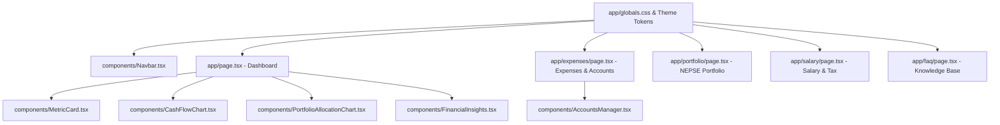

# Requirements

### Overview & Goals
The objective is to overhaul the visual design of **Finance-Dealer** from a generic AI-generated fintech dashboard (rounded cards, soft shadows, generic emerald/blue accent colors, floating pill elements) into an **intentional, distinctive Nepali Personal Finance & NEPSE Ledger**. 

The design is grounded in authentic Nepali financial artifacts:
- **Nepali Bank Passbooks & Ledgers ("Khata")**: Crisp 1px ruling borders, unbleached Lokta parchment backgrounds, high-contrast carbon ink typography, and structured balance reconciliation cells.
- **NEPSE Market Ticker Aesthetics**: Clean monospace tabular data for stock symbols (`NABIL`, `CIT`, `HDL`), share quantities, buy prices, LTP (Last Traded Price), and profit/loss calculations.
- **Nepali Rupee Numbering Conventions**: Monospace tabular numbers formatted in Lakhs and Crores (`Rs. 1,50,000.00`) across all ledger lines and metrics.

### Scope
- **In Scope**:
  - Global styles & CSS variables (`app/globals.css`, `app/layout.tsx`).
  - Navigation header (`components/Navbar.tsx`).
  - Main Dashboard (`app/page.tsx`) and subcomponents (`MetricCard.tsx`, `CashFlowChart.tsx`, `PortfolioAllocationChart.tsx`, `FinancialInsights.tsx`).
  - Income & Expenses tracking (`app/expenses/page.tsx`) and Accounts Manager (`components/AccountsManager.tsx`).
  - NEPSE Stock Portfolio (`app/portfolio/page.tsx`).
  - Salary & Tax Planner (`app/salary/page.tsx`).
  - FAQ & Support Hub (`app/faq/page.tsx`).
  - Full support for Light and Dark modes.
  - Full mobile responsiveness without horizontal scrolling.
- **Out of Scope**:
  - Functional logic changes, data schemas, calculation formulas, or Supabase backend contracts.
  - Adding new third-party styling frameworks or replacing Tailwind CSS.

### User Stories
- **As a Nepali Earner & Investor**, I want the app to look and feel like an authentic, high-density financial ledger rather than a generic SaaS clone, so that tracking my personal cash flow and NEPSE stocks feels authoritative, grounded, and focused.
- **As a User in Dark Mode**, I want the ledger aesthetic to translate smoothly into a high-contrast charcoal slate palette without losing border definitions or tabular readability.
- **As a Mobile User**, I want all tables, account cards, and forms to adapt gracefully to compact screens with no horizontal overflow or awkward layout shifts.

### Design Self-Critique & Anti-AI-Tell Verification
To ensure the redesign is genuinely distinctive and avoids ubiquitous AI-generated dashboard tropes, the plan explicitly avoids:
1. **No identical floating cards with soft grey drop-shadows (`shadow-lg`, `shadow-2xl`)**: Replaced with crisp 1px physical ruling lines (`border-[#DDD6C6]` / `dark:border-[#2A2D35]`) and subtle parchment background contrasts.
2. **No generic neon SaaS emeralds / purple gradients**: Replaced with culturally resonant colors (Lokta Parchment, Terai Banknote Green, Rhododendron Crimson, Mustard Passbook Ochre, and Carbon Ink).
3. **No excessive uppercase eyebrow labels above every card**: Headers use natural sentence/title case with purposeful hierarchy.
4. **No superficial numbered badges (01/02/03)**: Structured tables and step indicators only appear where meaningful sequences exist.
5. **No repetitive micro-animations**: Focuses on instant, crisp state feedback and rock-solid tabular data presentation.

### Non-Functional Requirements
- **Performance & Zero Bundling Overhead**: Utilizes pure Tailwind CSS v4 CSS variables without runtime styling libraries.
- **Accessibility & Contrast**: All text, badges, and monetary values meet WCAG AA contrast standards in both light and dark themes.
- **Responsive Fluidity**: Verified fluid layout from 360px mobile viewports up to 4K ultra-wide monitors.

# Technical Design

### Current Implementation & Deficiencies
While the project previously defined some initial CSS variables in `app/globals.css`, multiple pages (`app/expenses/page.tsx`, `app/portfolio/page.tsx`, `app/salary/page.tsx`, `app/faq/page.tsx`, `components/AccountsManager.tsx`) still rely on generic AI-template Tailwind patterns:
- Deeply rounded corners (`rounded-2xl`, `rounded-3xl`) and multi-layer soft drop shadows (`shadow-sm`, `shadow-md`, `shadow-xl`).
- Generic bright green (`bg-emerald-600`), rose (`bg-rose-600`), and sky blue (`bg-sky-500`) color combinations.
- Inconsistent table formatting and disparate button styles across different routes.

---

### Design Foundation

#### 1. Deliberate Color Palette
| Token Name | Light Hex | Dark Hex | Role & Cultural Association |
| :--- | :--- | :--- | :--- |
| **Lokta Parchment / Slate** | `#FBF9F5` | `#121316` | App background; evokes unbleached handmade Nepali Lokta paper / Himalayan charcoal slate. |
| **Passbook Surface** | `#F0ECE1` | `#1B1D22` | Card & table surface; subtle warm tint reminiscent of traditional bank passbook pages. |
| **Ruling Border** | `#DDD6C6` | `#2A2D35` | 1px structural accounting grid lines dividing ledger columns and summary sections. |
| **Carbon Ink** | `#1A1C20` | `#F3F4F6` | Primary high-contrast text and ledger entries. |
| **Terai Banknote Green** | `#1E5E3A` | `#34D399` | Inflows, positive net surplus, and portfolio gains. |
| **Rhododendron Crimson** | `#9E1B24` | `#F87171` | Outflows, expense totals, tax deductions, and portfolio pullbacks. |
| **Mustard Passbook Ochre**| `#B45309` | `#FBBF24` | Savings target warnings, balance reconciliations, and Dollar Card NRB rates. |

#### 2. Typography & Numerical Representation
- **Primary UI & Headings**: `Geist Sans` with crisp font-weights (`font-medium`, `font-semibold`, `font-bold`), tighter letter spacing (`tracking-tight`), and clear hierarchy.
- **Financial Data & Tickers**: `Geist Mono` with `tabular-nums` applied universally to all currency amounts (`Rs. 1,50,000.00`), percentages, dates (`YYYY-MM-DD`), and NEPSE stock ticker symbols (`NABIL`, `NICA`, `HDL`).

#### 3. Layout Concept & ASCII Wireframe
The layout is organized around a **Ledger Sheet Grid**: sharp, structural 1px border divisions, high-density financial metrics, and clear data tables instead of floating bubble widgets.

```
+-----------------------------------------------------------------------------------+
|  [FD] FINANCE-DEALER    [Dashboard]  [Expenses]  [Salary]  [NEPSE]  [FAQ]   user@...  |
+-----------------------------------------------------------------------------------+
|  MONTHLY PASSBOOK OVERVIEW                             Fiscal Period: 2081/82    |
|  +--------------------+ +--------------------+ +--------------------+ +-----------+
|  | TOTAL INFLOW       | | TOTAL OUTFLOW      | | INVESTABLE SURPLUS | | SAVINGS % |
|  | Rs. 1,45,000.00    | | Rs. 62,500.00      | | Rs. 82,500.00      | | 56.9%     |
|  | 3 Verified Sources | | 18 Logged Expenses | | Ready for NEPSE    | | Target 50%|
|  +--------------------+ +--------------------+ +--------------------+ +-----------+
|                                                                                   |
|  +-------------------------------------------+ +----------------------------------+
|  | CASH FLOW COMPARISON                      | | NEPSE PORTFOLIO VALUATION        |
|  | [Inflow] ====== Rs. 1.45L                 | | Current Value: Rs. 4,85,200.00   |
|  | [Outflow] ==== Rs. 0.62L                  | | Total Profit:  +Rs. 64,300 (+15%)|
|  | [Surplus] ====== Rs. 0.82L                | | [Allocation Chart: NABIL, CIT...] |
|  +-------------------------------------------+ +----------------------------------+
|                                                                                   |
|  +--------------------------------------------------------------------------------+
|  | FINANCIAL AUDITS & LEDGER OBSERVATIONS                                          |
|  | [SPENDING]  High Food Outflow: Rs. 24,000 logged this month (+18% vs baseline) |
|  | [PORTFOLIO] Sector Balance: Banking sector accounts for 62% of equity holdings  |
|  +--------------------------------------------------------------------------------+
+-----------------------------------------------------------------------------------+
```

---

### Component & Page Redesign Architecture



### Detailed File Changes

1. **`app/globals.css` & `app/layout.tsx`**:
   - Refine CSS custom properties for light/dark mode with exact physical ledger hex codes.
   - Configure global tabular typography and subtle scrollbar styling.
2. **`components/Navbar.tsx`**:
   - Replace floating rounded header with a crisp 1px bordered passbook header.
   - Use understated active tab styling with bottom border accents (`border-[#1E5E3A]` / `dark:border-[#34D399]`).
   - Clean mobile quick-nav with horizontal scroll snap and zero layout overflow.
3. **`app/page.tsx` & Dashboard Components (`MetricCard.tsx`, `CashFlowChart.tsx`, `PortfolioAllocationChart.tsx`, `FinancialInsights.tsx`)**:
   - Unify cards with border-led containers (`border-[#DDD6C6] dark:border-[#2A2D35] bg-[#FBF9F5] dark:bg-[#181A1F]`).
   - Format all monetary figures with `font-mono tabular-nums`.
   - Restyle Recharts tooltips, grid lines, and axis ticks to match ledger typography.
4. **`app/expenses/page.tsx` & `components/AccountsManager.tsx`**:
   - Replace rounded pill inputs and generic color badges with structured passbook table rows.
   - Update verification locks, Dollar Card NRB conversion boxes, and balance adjustment dialogs to match ledger visual tokens.
5. **`app/portfolio/page.tsx`**:
   - Redesign stock table into a dense NEPSE trading floor sheet with crisp column borders, monospace LTP figures, and green/red profit-loss indicators.
   - Style live price sync indicators and holding addition forms.
6. **`app/salary/page.tsx` & `app/faq/page.tsx`**:
   - Transform salary planning inputs and tax bracket breakdown into a multi-column fiscal calculation sheet.
   - Restyle FAQ accordion items with crisp bordered panels.

# Testing

### Validation Approach
Verification focuses on visual consistency, theme switching accuracy, responsive stability, and zero functional regressions:

1. **Design System & Theme Integrity**:
   - Verify all pages render with the designated Lokta Parchment palette in light mode and Basalt Slate in dark mode.
   - Confirm all monetary values use monospace tabular formatting (`tabular-nums`) with Nepali numbering conventions.
   - Check that no generic floating card shadows or neon SaaS styles remain.

2. **Route & Component Visual Walkthrough**:
   - **Dashboard (`/`)**: Metric cards, Cash Flow chart, Portfolio Allocation chart, and Financial Insights audits.
   - **Expenses (`/expenses`)**: Transaction form, Dollar Card FX calculator, transaction table, verification badges, and Accounts Manager drawer.
   - **Portfolio (`/portfolio`)**: NEPSE holdings table, live price status badge, holding addition form, and sector metrics.
   - **Salary (`/salary`)**: Pay inputs, savings goals tracker, and Nepal income tax bracket table.
   - **FAQ (`/faq`)**: Expandable accordion panels and categorized navigation.

3. **Mobile Responsiveness**:
   - Verify viewports from 375px (mobile) to 1440px+ (desktop).
   - Ensure the Navbar and data tables handle narrow viewports cleanly with horizontal table scrolling where appropriate and no body overflow.

4. **Build & Type Checking**:
   - Execute `npm run build` to guarantee zero TypeScript or build errors.

# Delivery Steps

### ✓ Step 1: Establish Design System Tokens & Global Ledger Styling
Establish the core design system tokens and shared ledger styling foundations:
- Update `app/globals.css` with precise CSS variables and utility classes for the Lokta Paper/Basalt Slate palette, crisp 1px ledger ruling borders, and tabular financial number styling.
- Refine color tokens (`--background`, `--foreground`, `--surface`, `--surface-muted`, `--border-ledger`, `--color-forest`, `--color-crimson`, `--color-ochre`) with seamless light and dark mode mappings.
- Eliminate generic blur/drop-shadow dependencies and establish clean border-driven container styling primitives.
- Verify `app/layout.tsx` background, font variables, and viewport theme colors align with the physical ledger aesthetic.

### ✓ Step 2: Redesign Navbar Header & Main Dashboard
Redesign the global navigation bar and central dashboard into a cohesive ledger view:
- Restyle `components/Navbar.tsx` to feature a compact passbook header layout with crisp tab borders, subtle active indicators, responsive mobile quick-tabs, and authentic Nepali finance branding.
- Overhaul `app/page.tsx` (Dashboard), replacing generic rounded cards and floating shadows with structured ledger compartments, passbook summary headers, and clean financial metrics.
- Align `components/MetricCard.tsx`, `components/CashFlowChart.tsx`, `components/PortfolioAllocationChart.tsx`, and `components/FinancialInsights.tsx` with the ledger ruling borders and Nepal-specific data presentation (Lakhs/Crores tabular figures).

### * Step 3: Redesign Expenses Ledger & Accounts Management
Transform the Income & Expenses page and Accounts Manager into an authentic accounting passbook:
- Redesign `app/expenses/page.tsx` transaction entry form, replacing generic SaaS pill switches and rounded inputs with clean ledger input fields and passbook action buttons.
- Overhaul the transaction history table with physical ledger column lines, monospace dates/amounts, crisp verification status indicators, and clear fix-up reconciliation callouts.
- Restyle `components/AccountsManager.tsx` to present bank accounts, eSewa/Khalti digital wallets, and cash drawers in a crisp Nepali banking summary layout with dedicated reconciliation and transfer drawers.

###   Step 4: Redesign NEPSE Stock Portfolio & Live Market Ticker
Modernize the NEPSE equity portfolio tracker with a high-density financial ticker layout:
- Restyle `app/portfolio/page.tsx` to resemble a crisp NEPSE trading sheet with clear symbol badges, sector tags, profit/loss ledger indicators, and live market status banners.
- Redesign the stock purchase form, current price editing modals, and portfolio analytics cards with border-led grid cells and monospace tabular numbers.
- Ensure live market polling indicators and manual refresh actions fit the understated financial workstation aesthetic.

###   Step 5: Redesign Salary & Tax Planner, FAQ, and Build Verification
Unify the Salary & Tax Planner and FAQ knowledge base under the new design language:
- Redesign `app/salary/page.tsx` to present monthly earnings, mandatory deductions, savings targets, and Nepal tax slab breakdowns in a clear tax computation ledger sheet.
- Redesign `app/faq/page.tsx` replacing generic floating accordion cards with structured, bordered topic panels and crisp typography.
- Execute `npm run build` and verify zero TypeScript, ESLint, or runtime compilation regressions across light and dark modes.