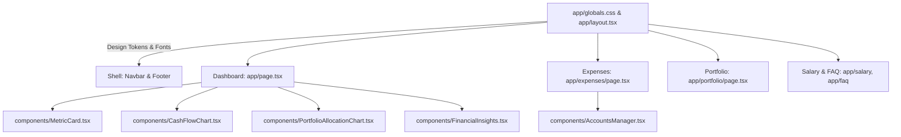

# Requirements

### Overview & Goals
The goal of this initiative is to completely transform Finance-Dealer from a generic AI-templated SaaS dashboard (floating rounded cards, soft grey box-shadows, default emerald/blue gradients, and generic typography) into an **intentional, distinctive Nepali personal finance and NEPSE tracking operating system**.

The redesign draws direct inspiration from:
1. **Nepali Bank Passbooks & Ledgers**: Clean, high-density line borders, structured debit/credit accounting sections, and purposeful document headers.
2. **NEPSE Market Ticker Rhythm**: Crisp tabular numbers, clear profit/loss indicators, and compact financial data presentation.
3. **South Asian Numbering Conventions**: Uncompromising support for Nepali Rupee formatting (Lakhs and Crores, not Millions/Billions).

---

### Scope

#### In Scope
- **Color System**: Deliberate custom 6-color palette (Himalayan Slate, Basalt Charcoal, Parchment Cream, Terai Forest Sage, Rhododendron Crimson, and Bankbook Ochre).
- **Typography & Data Display**: Clear distinction between editorial headings, readable body text, and tabular monospace numerals for financial figures.
- **Layout & Structure**: Ledger-style asymmetrical layout, clean 1px border grids, and structured tabular data presentation instead of floating cards with soft drop shadows.
- **Pages & Components Covered**:
  - Global Shell: `app/layout.tsx`, `app/globals.css`, `components/Navbar.tsx`, `components/Footer.tsx`
  - Dashboard: `app/page.tsx`, `components/MetricCard.tsx`, `components/CashFlowChart.tsx`, `components/PortfolioAllocationChart.tsx`, `components/FinancialInsights.tsx`
  - Expenses & Accounts: `app/expenses/page.tsx`, `components/AccountsManager.tsx`
  - NEPSE Portfolio: `app/portfolio/page.tsx`
  - Salary & Tax: `app/salary/page.tsx`
  - FAQ: `app/faq/page.tsx`
- **Theme Support**: Seamless light mode and dark mode execution across all elements.
- **Mobile Responsiveness**: Full responsive layout with zero horizontal overflow.

#### Out of Scope
- Modifying calculation logic, Supabase database queries, API routes, or state management workflows.
- Replacing Tailwind CSS with a third-party UI library (e.g. Shadcn, Material UI, Mantine).
- Altering user authentication flows or email summary schedules.

---

### User Stories
- **As a Nepali Earner & Saver**, I want the app to feel like an authentic, professional Nepali financial tool rather than a generic American Silicon Valley template, so that managing my salary, savings, and expenses feels natural and trustworthy.
- **As a NEPSE Investor**, I want stock prices, holdings, and portfolio gains/losses to be displayed with high-density tabular clarity, so that I can quickly assess my equity positions like looking at a market floor sheet.
- **As a Mobile User**, I want all tables, charts, and input forms to fit cleanly on my screen without horizontal overflow or clipped navigation elements.

---

### Non-Functional Requirements
- **Performance**: Zero additional heavy CSS runtime dependencies; clean Tailwind CSS utilities.
- **Accessibility & Contrast**: All text and numerical data must pass WCAG AA contrast standards in both light and dark modes.
- **Zero Logic Regressions**: All calculations (account balances, savings rate, portfolio analytics, live FX conversion) must retain 100% fidelity.

# Design Specification

### Two-Pass Design Plan

#### Pass 1: Design Specification

##### 1. Color Palette (Deliberately chosen, non-generic)
A grounded, tactile palette inspired by Nepali financial documents, Himalayan terrain, and cultural markers:

| Token Name | Light Mode Hex | Dark Mode Hex | Usage / Semantic Role |
| :--- | :--- | :--- | :--- |
| **Parchment / Basalt (Base)** | `#FBF9F5` (Parchment Paper) | `#121316` (Basalt Charcoal) | Background surface; tactile, non-sterile white/black. |
| **Himalayan Slate (Surface)** | `#F0ECE1` (Warm Ledger) | `#1B1D22` (Deep Slate) | Card, container, and table header background. |
| **Ledger Rule (Border)** | `#DDD6C6` (Ink Border) | `#2A2D35` (Slate Rule) | 1px clean gridlines and divider borders; replaces soft shadows. |
| **Terai Forest (Surplus/Gain)** | `#1E5E3A` (Deep Forest Sage) | `#34D399` (Crisp Sage Leaf) | Inflows, positive savings, NEPSE green gainers. |
| **Rhododendron Crimson (Loss/Alert)**| `#9E1B24` (Lali Gurans Crimson) | `#F87171` (Soft Crimson) | Outflows, deficits, NEPSE red losers, lock warnings. |
| **Bankbook Ochre (Accent/Notice)** | `#B45309` (Passbook Amber) | `#FBBF24` (Gold Ochre) | Verified seals, Dollar Card FX tags, status badges. |

##### 2. Typography & Numerical Hierarchy
- **Headings & Titles**: `Geist Sans` with crisp geometric tracking (`tracking-tight`), distinct medium/bold weights without forced ALL-CAPS screaming.
- **Body & Captions**: Clean, high-legibility proportional type for transaction notes, explanations, and labels.
- **Financial Figures & Tickers**: `Geist Mono` (`font-mono`) with `tabular-nums` enabled for all monetary values (Rs. and USD), quantities, percentages, and dates, guaranteeing vertical column alignment across rows.

##### 3. Layout Concept & ASCII Wireframe
**Concept**: A structured **Passbook / Financial Balance Sheet** layout with clear horizontal rules and asymmetrical two-column accounting flow, rather than identical floating square cards.

```
+-------------------------------------------------------------------------------+
| [FD] FinanceDealer  |  Dashboard  Expenses  Salary  Portfolio  FAQ  | User: spandan |
+-------------------------------------------------------------------------------+
| NEPSE INDEX: 2,745.30 (+1.2%)  |  USD/NPR: 140.25 (NRB Live)  |  FISCAL YR: 82/83 |
+-------------------------------------------------------------------------------+
|                                                                               |
|  [ FINANCIAL OVERVIEW LEDGER ]                                                |
|  ===========================================================================  |
|  + TOTAL MONTHLY INFLOW       - MONTHLY OUTFLOW          = INVESTABLE SURPLUS |
|    Rs. 1,25,000.00 (3 Sources)  Rs. 62,500.00 (12 Logs)    Rs. 62,500.00 (50%)|
|  ---------------------------------------------------------------------------  |
|                                                                               |
|  +---------------------------------------+ +--------------------------------+ |
|  | [RECENT LEDGER ENTRIES]               | | [NEPSE EQUITY HOLDINGS]        | |
|  | Date       Description     Amt (Rs.)   | | Symbol  Qty  LTP    P/L (NPR)  | |
|  | ---------- --------------- -----------| | ------- ---- ------ ---------- | |
|  | 2026-09-20 Monthly Salary  +1,00,000.00| | SHIVM   100  540.00 +4,200 (8%)| |
|  | 2026-09-21 Flat Rent        -25,000.00| | NABIL   150  610.00 +6,150 (7%)| |
|  | 2026-09-21 Bhatbhateni      - 4,250.00| | CIT      50 2150.00 -1,100 (1%)| |
|  +---------------------------------------+ +--------------------------------+ |
|                                                                               |
|  +--------------------------------------------------------------------------+ |
|  | [FINANCIAL HEALTH & TAX POSITION]                                        | |
|  | Estimated Tax: Rs. 14,200/mo  |  Annual Savings Run-Rate: Rs. 7,50,000   | |
|  +--------------------------------------------------------------------------+ |
+-------------------------------------------------------------------------------+
```

##### 4. Principles Grounded in Nepali Context
1. **Lakhs / Crores First-Class Citizens**: All currency formatting explicitly uses `en-NP` format (`1,00,000` not `100,000`).
2. **Ink & Paper Tactility**: Replacing floating SaaS shadows (`shadow-lg`, `shadow-xl`) with crisp 1px borders (`border border-zinc-200 dark:border-zinc-800`), parchment tones, and subtle structural dividers.
3. **NEPSE Floor Sheet Density**: Compact, legible financial tables where numbers align to the right in tabular monospace font.

---

#### Pass 2: Self-Review Against AI Design Tells

| Overused AI-Design Tell | Replaced With |
| :--- | :--- |
| **Identical rounded cards with soft grey box-shadow on everything** | Clean structured ledger borders (`border`, `divide-y`), parchment/slate surfaces, and minimal flat borders (`shadow-none` or subtle 1px frame). |
| **Generic emerald/blue/purple SaaS gradients with no subject connection** | Deep Terai Forest Green (`#1E5E3A`), Lali Gurans Crimson (`#9E1B24`), and Bankbook Ochre (`#B45309`). |
| **ALL-CAPS screaming labels above every section** | Natural sentence-case titles with clear weight hierarchy (e.g., "Monthly Cash Flow" instead of "MONTHLY CASH FLOW"). |
| **Numbered sequence badges (01, 02, 03) on non-sequential items** | Semantic icon markers or structured ledger section headers. |
| **Meta text joined with middle-dots or spaced em-dashes (` · ` / ` — `)** | Structured table cells or pill chips with clear typographic distinction. |
| **Identical fade-in/slide-up animations on every card** | Fast, subtle transitions (`transition-colors duration-150`) focused on interaction and hover states. |

# Technical Design

### Current Implementation vs Proposed Architecture

#### 1. CSS & Token System
- **Current**: Default Tailwind palette (`zinc-50`, `zinc-900`, `emerald-600`, `rose-600`, `blue-600`) with heavy reliance on generic pill borders and `shadow-md`/`shadow-xs`.
- **Proposed**: Custom theme variables in `app/globals.css` with semantic names mapping to the light/dark palette, applied cleanly via Tailwind utility classes.

#### 2. Component Refactoring Strategy



#### 3. Specific File Changes

1. **`app/globals.css`**:
   - Define custom color CSS variables (`--bg-parchment`, `--bg-basalt`, `--border-ledger`, `--color-forest`, `--color-crimson`, `--color-ochre`).
   - Set up custom table, input, and scrollbar utility styles.

2. **`components/Navbar.tsx`**:
   - Redesign brand mark: Replace generic green square with clean typographic monogram and subtitle ("NEPALESE PERSONAL FINANCE & NEPSE OS").
   - Replace floating pill links with crisp tabbed navigation and border indicators.

3. **`components/MetricCard.tsx`**:
   - Remove outer soft shadows; apply structured 1px ledger borders.
   - Align labels, amounts, and delta chips with clear typography and `font-mono tabular-nums`.

4. **`app/page.tsx`**:
   - Implement the Passbook overview layout with distinct Inflow, Outflow, and Surplus ledger compartments.
   - Embed the market indicator bar and clean transaction & holdings summaries.

5. **`app/expenses/page.tsx` & `components/AccountsManager.tsx`**:
   - Restyle transaction table into an authentic accounting ledger with clear debit/credit alignment.
   - Style verified seals with the Bankbook Ochre badge.
   - Refactor the form into a clean ledger input card.

6. **`app/portfolio/page.tsx`**:
   - Format stock holdings into a NEPSE floor sheet style table with compact rows and clear profit/loss styling.

7. **`app/salary/page.tsx` & `app/faq/page.tsx`**:
   - Clean up tax calculation display and savings goal cards to match the ledger aesthetic.
   - Restyle FAQ accordion cards with clean borders and consistent typography.

---

### Risks & Mitigations

| Risk | Impact | Mitigation |
| :--- | :--- | :--- |
| **Contrast degradation in dark mode** | Text readability issues on custom dark backgrounds | Strict verification against WCAG AA color contrast standards for both light (`#FBF9F5`) and dark (`#121316`) palettes. |
| **Table overflow on small mobile screens** | Broken responsive layout | Wrap all data tables in `overflow-x-auto` with clean minimum column widths and non-breaking numeric cells. |
| **Unintended calculation / state regression** | Data loss or calculation desync | Purely restrict edits to JSX styling and CSS classes; zero modification to calculation functions or Supabase query hooks. |

# Testing

### Validation Approach

1. **Automated Build & Type Check**:
   - Run `npm run build` with Turbopack to verify zero compilation or TypeScript type errors across all routes.

2. **Visual Inspection & Quality Checklist**:
   - **Color Palette**: Verify all pages use the cohesive 6-token palette in both light and dark modes.
   - **Typography**: Verify `font-mono tabular-nums` is used on all currency figures (Rs. and USD), quantities, and dates.
   - **AI Tells Check**: Verify absence of floating soft shadows, generic blue/purple SaaS gradients, screaming ALL-CAPS headers, and arbitrary sequence markers.
   - **Mobile Responsiveness**: Test at 360px, 768px, and 1280px widths to confirm no horizontal scrolling in the viewport shell.

3. **Functionality Preservation Check**:
   - Add/edit/delete transactions in guest and authenticated modes.
   - Dollar Card USD to NPR conversion display with live/stale rate notices.
   - Verified transaction locking and deletion guards.
   - Account balance live calculation accuracy.
   - NEPSE stock holdings analytics and profit/loss math.
   - Salary & tax bracket calculator output.

# Delivery Steps

### ✓ Step 1: Design Tokens, Typography, and Shell Foundation
The foundational CSS variables, typography definitions, and navigation headers are updated to establish the new design language across the app.

- Update `app/globals.css` with the custom Nepali ledger color tokens (`--color-parchment`, `--color-basalt`, `--color-terai-forest`, `--color-rhododendron-crimson`, `--color-mustard-ochre`, `--color-himalayan-slate`).
- Configure global root font variables in `app/layout.tsx` to enable editorial serif headings, clean body text, and tabular monospace figures.
- Refactor `components/Navbar.tsx` and `components/Footer.tsx` away from generic SaaS pill tags and floating rounded badges to a crisp bank-ledger header with structured status chips, thin borders, and responsive desktop/mobile layouts.

### ✓ Step 2: Dashboard & Core KPI Metric Redesign
The central dashboard and its supporting visual components are redesigned with an asymmetrical ledger balance-sheet aesthetic.

- Restyle `components/MetricCard.tsx` to replace floating rounded shadow cards with structured, bordered ledger cells featuring clear currency labeling (Rs. with Nepali numbering conventions) and restrained accent rules.
- Redesign `app/page.tsx` with a dual-column Ledger Balance Sheet (Income vs Expenses vs Investable Surplus) and integrated NEPSE Market summary strip.
- Update `components/CashFlowChart.tsx` and `components/PortfolioAllocationChart.tsx` to align with the new parchment/basalt and forest/crimson color palette.
- Restyle `components/FinancialInsights.tsx` to present actionable observations with clean typography and ledger-rule dividers rather than floating colorful callout cards.

### * Step 3: Expenses & Accounts Passbook Redesign
The Income & Expenses and Accounts Management interface is converted into a structured financial passbook/ledger layout.

- Redesign `app/expenses/page.tsx` input forms and transaction history tables with tabular alignment, clear ledger row striping, verified lock badges, and Dollar Card conversion indicators.
- Refactor `components/AccountsManager.tsx` with bankbook-style account cards, balance adjustment reconciliation tools, and transfer records.
- Preserve all existing logic, verified transaction protections, and guest mode memory persistence without behavioral alterations.

###   Step 4: Portfolio, Salary & FAQ Redesign
The NEPSE portfolio, salary planning, and FAQ views are restyled to complete the cohesive application-wide visual identity.

- Redesign `app/portfolio/page.tsx` with a high-density NEPSE trading terminal feel: ticker table layout, sector allocation bars, live price status badge, and profit/loss indicators using Terai forest and Rhododendron crimson.
- Restyle `app/salary/page.tsx` to format tax bracket tables, income deduction inputs, and savings goal milestones with crisp borders and clean tabular figures.
- Restyle `app/faq/page.tsx` accordion cards with structured borders and intentional typography hierarchy.
- Ensure light and dark mode styling is seamless across all three pages.

###   Step 5: Build Verification & Visual Audit
The entire application builds cleanly with zero TypeScript errors and meets all responsive and visual criteria.

- Run `npm run build` with Turbopack and verify all 16 static/dynamic routes compile cleanly.
- Verify mobile viewport responsiveness across all pages, ensuring no horizontal overflow or clipped tables.
- Validate dark and light mode contrast across all new color tokens, borders, and input controls.